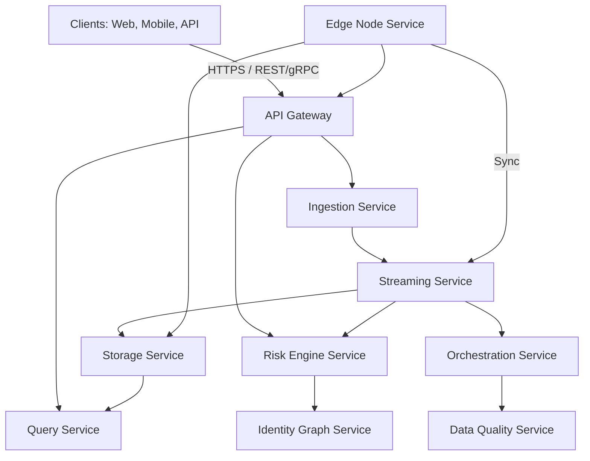
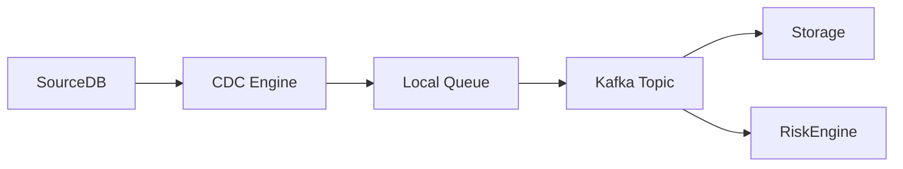
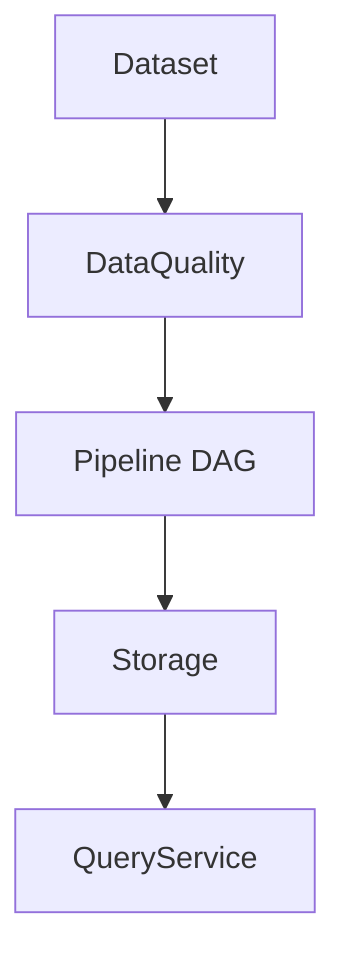
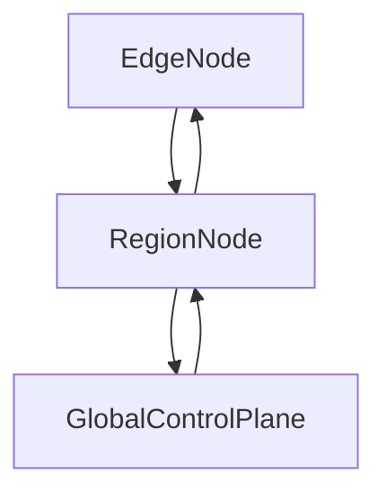

# 04_ARCHITECTURE.md

## ☁️ Africa Cloud — Distributed Data & Intelligence Platform

---

# 1. 🧾 Overview

**Africa Cloud** is a distributed, edge-first, multi-region cloud platform designed specifically for African realities.

Goals:

* Operate in **low bandwidth and intermittent connectivity** conditions
* Maintain **data sovereignty** (country-level control)
* Provide **data & intelligence services** for banks, startups, governments, and telcos
* Combine the capabilities of top global cloud providers (AWS, GCP, Azure, IBM, Oracle) into a **unified platform optimized for Africa**

---

# 2. 🎯 System Philosophy

| Dimension           | Traditional Cloud            | Africa Cloud                     |
| ------------------- | ---------------------------- | -------------------------------- |
| Internet Dependency | Always-on                    | Offline-first, edge-first        |
| Latency             | Optimized for global regions | Optimized for African edge nodes |
| Data Consistency    | Strong consistency           | Eventually consistent            |
| Compute             | Centralized                  | Local + edge + regional + global |
| Cost                | High                         | Low-cost infrastructure          |
| Data Sovereignty    | Limited                      | Country-level enforced           |

---

# 3. 🏗️ High-Level Architecture



**Layers:**

1. **Edge Layer** – Local compute and offline ingestion
2. **Ingestion & Streaming Layer** – Event-driven ingestion & change capture
3. **Storage Layer** – Lakehouse, object storage, and time-series logs
4. **Processing & Orchestration Layer** – DAG pipelines, batch & streaming workflows
5. **Risk & Intelligence Layer** – AI-driven fraud detection, credit scoring, AML
6. **API Layer** – Exposes platform as a consumable API

---

# 4. 🖥️ Edge Layer Architecture

**Edge nodes** are Africa Cloud’s breakthrough:

* Lightweight **K3s Kubernetes clusters** deployed at telco towers, rural hubs, or city data centers
* Run **WASM workloads** for lightweight, portable computation
* Offline-first capabilities with **local queues** and **retry logic**
* **Sync Engine** ensures eventual consistency with regional and global nodes

**Edge Components:**

| Component         | Role                                              |
| ----------------- | ------------------------------------------------- |
| Node Agent        | Deploys workloads, monitors health                |
| Sync Agent        | Handles event replication and conflict resolution |
| Local DB          | Stores temporary datasets, metadata, events       |
| Metrics Collector | Observability at the edge                         |

---

# 5. 🔄 Ingestion & Streaming Layer

* **Connectors**: Postgres, MySQL, MongoDB, API endpoints, CSV/Excel files
* **Streaming Engine**: Kafka or Redpanda for distributed messaging
* **CDC Engine**: Real-time Change Data Capture for databases
* **Offline Handling**: Local queues with auto-retries for intermittent connectivity

**Event Flow:**



---

# 6. 🗄️ Storage Layer (Lakehouse)

* Object Storage (S3-compatible) for raw + versioned datasets
* Columnar storage (Parquet) for analytics
* Metadata DB (Postgres) tracks datasets, versions, lineage
* Multi-country partitioning for **data sovereignty**
* Queryable via SQL / API endpoints

---

# 7. ⚙️ Processing & Orchestration Layer

* **Workflow Engine**: DAG-based pipelines, supports batch + streaming
* **Compute Engine**: Edge or cloud compute for analytics
* **Data Quality Engine**: Validation, anomaly detection, rule-based checks

**Pipeline Flow Example:**



---

# 8. 🧠 Risk & Intelligence Layer

* **Fraud Detection Engine**: Graph-based analysis, real-time scoring
* **Credit Scoring Engine**: Alternative data (mobile money, telco usage)
* **AML Engine**: Suspicious transaction detection

**Graph Example (Neo4j)**:

```plaintext
(User)-[:OWNS]->(Account)
(Account)-[:SENT]->(Transaction)
(Transaction)-[:TO]->(Account)
(User)-[:USES]->(Device)
```

* AI models trained on **African transaction patterns**

---

# 9. 🔗 API Layer

* Exposes all platform services via **REST/gRPC**

* Provides endpoints for:

  * Data ingestion
  * Query execution
  * Risk scoring
  * Identity graph queries

* Inspired by **Stripe / Plaid** for simplicity and developer friendliness

---

# 10. 🔄 Sync Engine Layer (Edge → Regional → Global)

* **Event-driven replication** with CRDTs
* Delta-based data transfer
* Conflict detection & resolution
* Retry with exponential backoff
* Observability via **sync logs & metrics**

**Hierarchy:**



---

# 11. 🛡️ Security Architecture

* **Transport:** TLS 1.3
* **Storage:** AES-256 encryption
* **Application:** RBAC, JWT/OAuth authentication
* **Audit:** Immutable logs stored per node and globally

---

# 12. 📈 Scalability & Reliability

* **Horizontal Scaling:** Add more edge nodes per region
* **Vertical Scaling:** Upgrade hardware per node
* **Failover:** Multi-region replication for uptime
* **Observability:** Prometheus + ELK stack for metrics & logs

---

# 13. 🏁 MVP Scope

For first 3–6 months:

1. Edge node deployment with sync engine
2. Ingestion service + basic connectors (Postgres, API)
3. Streaming service (Kafka-based)
4. Storage service with S3 + Parquet
5. Orchestration UI with DAG pipelines
6. Basic risk scoring API

---

# 14. 📌 Key Design Decisions

* **Edge-first, Offline-capable**: Core differentiator
* **Event-driven with CRDTs**: Enables conflict-free replication
* **Polyglot persistence**: Optimizes storage and performance
* **Country-level data partitioning**: Enforces sovereignty
* **API-first exposure**: Simplifies integration for African developers

---

# 15. 🌐 References

* Apache Kafka: Distributed streaming
* MinIO/S3: Object storage
* Postgres: Metadata & configs
* Neo4j: Graph database for fraud detection
* K3s + WASM: Lightweight edge compute
* Databricks / Snowflake: Lakehouse inspiration

---

This **04_ARCHITECTURE.md** now fully defines **the platform at every layer**, ready for engineering teams to implement the SSDD, DB schemas, and Sync Engine.

---
