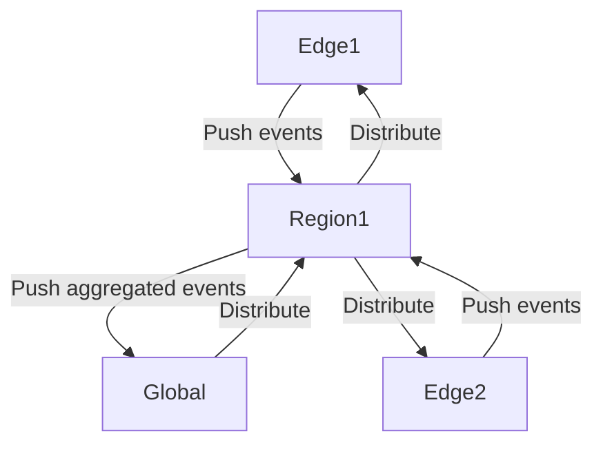

# 🔄 SYNC ENGINE PROTOCOL — Africa Cloud

---

## 1. 🧠 Overview

The **Sync Engine** ensures that:

* Edge nodes and central nodes are **eventually consistent**
* Data can be ingested **offline** and synced later
* Conflicts are detected and resolved automatically
* Multi-tenant data sovereignty is preserved

---

## 2. ⚡ Core Principles

1. **Event-Driven**: Every change is an immutable event with UUID, timestamp, and tenant context.
2. **CRDT + Operational Transforms**: Conflict-free replicated data types for automatic merges.
3. **Hierarchical Sync**: Edge → Regional → Global Control Plane
4. **Delta-Based**: Only changes are sent (no full dataset transfer unless necessary).
5. **Retry & Reconciliation**: Handles intermittent connectivity gracefully.

---

## 3. 🏗️ Node Types

| Node Type                | Role                                                      |
| ------------------------ | --------------------------------------------------------- |
| **Edge Node**            | Local compute, ingestion, temporary storage, offline sync |
| **Regional Node**        | Aggregates multiple edges, enforces regional compliance   |
| **Global Control Plane** | Master metadata, cross-region orchestration, audit logs   |

---

## 4. 🔗 Event Structure

```json
{
  "event_id": "uuid-v4",
  "tenant_id": "uuid",
  "node_id": "uuid",
  "entity": "dataset | transaction | user",
  "operation": "INSERT | UPDATE | DELETE",
  "payload": {},
  "version": 3,
  "timestamp": "2026-03-28T15:30:00Z",
  "conflict_hash": "sha256hash",
  "origin_node": "node_uuid"
}
```

---

## 5. 🔄 Sync Modes

### 5.1 **Push Mode**

* Edge node pushes its local events to regional node
* Used for:

  * Edge → Regional
  * Regional → Global

### 5.2 **Pull Mode**

* Node requests missing events from parent node
* Useful for:

  * Offline nodes catching up

### 5.3 **Hybrid / Auto**

* Smart mode: node decides push/pull based on network quality

---

## 6. 🧩 Sync Hierarchy



* **Edge Nodes**: Collect + store events locally
* **Regional Nodes**: Aggregate events, resolve conflicts locally
* **Global Control Plane**: Final authority on schema, audit, cross-region sync

---

## 7. ⚔️ Conflict Resolution

### 7.1 Conflict Detection

* Compare `version` and `conflict_hash` per entity
* If mismatch → create **conflict record** in `conflicts` table

### 7.2 Resolution Strategies

| Strategy              | When to Use                                        |
| --------------------- | -------------------------------------------------- |
| Last-Write-Wins (LWW) | Simple fields, low criticality                     |
| Merge via CRDT        | Counters, sets, lists                              |
| Custom Resolver       | Transactions, financial data (edge + global logic) |

---

## 8. 📦 Sync Metadata

Each node tracks:

| Field          | Description                |
| -------------- | -------------------------- |
| last_event_id  | UUID of last applied event |
| last_timestamp | ISO8601 timestamp          |
| node_status    | online/offline             |
| retry_queue    | list of failed events      |
| conflicts      | unresolved conflicts       |

---

## 9. 🛠️ Sync Protocol Lifecycle

1. **Event Capture**: Ingestion service emits events → local queue
2. **Local Storage**: Events stored in Cassandra / Postgres
3. **Event Packaging**: Batch events → `sync_packet` JSON
4. **Transmission**: Push or pull to parent node
5. **Conflict Check**: Compare versions & hashes
6. **Conflict Resolution**: Auto merge / custom logic
7. **Acknowledgement**: Successful events marked as synced
8. **Retry**: Failed events retried with exponential backoff

---

## 10. 📡 Packet Structure

```json
{
  "packet_id": "uuid",
  "origin_node": "uuid",
  "destination_node": "uuid",
  "events": [
    {...event1...},
    {...event2...}
  ],
  "created_at": "ISO8601",
  "checksum": "sha256hash"
}
```

* **Max Size**: Configurable per edge node (~10MB default)
* **Retries**: Exponential backoff, max retries = 5

---

## 11. 🔒 Security

* TLS 1.3 for all transmissions
* JWT token for node authentication
* End-to-end encryption (AES-256) of payloads

---

## 12. 🕹️ Observability

* Metrics per node:

  * Events sent / received
  * Latency
  * Conflicts detected
  * Retry counts

* Logs stored locally + aggregated to regional node

---

## 13. ⚡ Performance Optimizations

* Delta compression (send only changed fields)
* Batching (100–1000 events per packet)
* Parallel streams per topic
* Edge caching for hot datasets

---

## 14. 🏁 Summary

* **Edge-first, offline-capable**
* **Conflict-aware & CRDT-enabled**
* **Hierarchical, multi-region sync**
* **Event-driven, retry-safe**
* **Secure & observable**

This is **the core differentiator** of Africa Cloud. If you get this right, your platform can survive African network realities and **dominate locally before scaling globally**.

---

